<style>
section::after {
  content: attr(data-marpit-pagination) '/' attr(data-marpit-pagination-total);
}
</style>

<!-- paginate: skip -->

# Topology, Set Theory, and the $\pi$-Base

## 59th Spring Topology and Dynamics Conference

### Steven Clontz, 2026 March 13

<https://clontz.org> | [ScholarLattice Event Page](https://scholarlattice.org/events/7f198c18-12a7-46bf-8a5c-0d0136325d0c)

---

<!-- paginate: true -->

# Topology, Set Theory, and the $\pi$-Base

**Abstract.** The [$\pi$-Base](https://topology.pi-base.org/) was recognized in Fall 2025 as the highest-voted [crowdsourced math project on Terence Tao's MathOverflow list](https://mathoverflow.net/questions/500720/list-of-crowdsourced-math-projects-actively-seeking-participants). While much can be done by simply modeling Objects/Spaces, Properties, and Theorems, without a notion of set theory and cardinality, we quickly find limitations, for example:

- Several "open questions" on $\pi$-Base are equivalent to the Continuum Hypothesis
- Thirteen properties on $\pi$-Base are just different cardinalities, with explicit theorems written to connect them.

We will discuss the current plan to incorporate results from set theory into the $\pi$-Base, and seek input from potential users.

---

# What is a $\pi$-Base?

* A collection of nonempty open sets $\mathcal P$ such that for every nonempty open set $U$ there exists a $P\in\mathcal P$ such that $U\subseteq P$.
* However, we've ruined your ability to find that out via Google, because it's also a reasonably popular website for querying knowledge about topological spaces, properties, and theorems.
    * Check it out at [Topology.pi-Base.org](https://topology.pi-base.org)

---

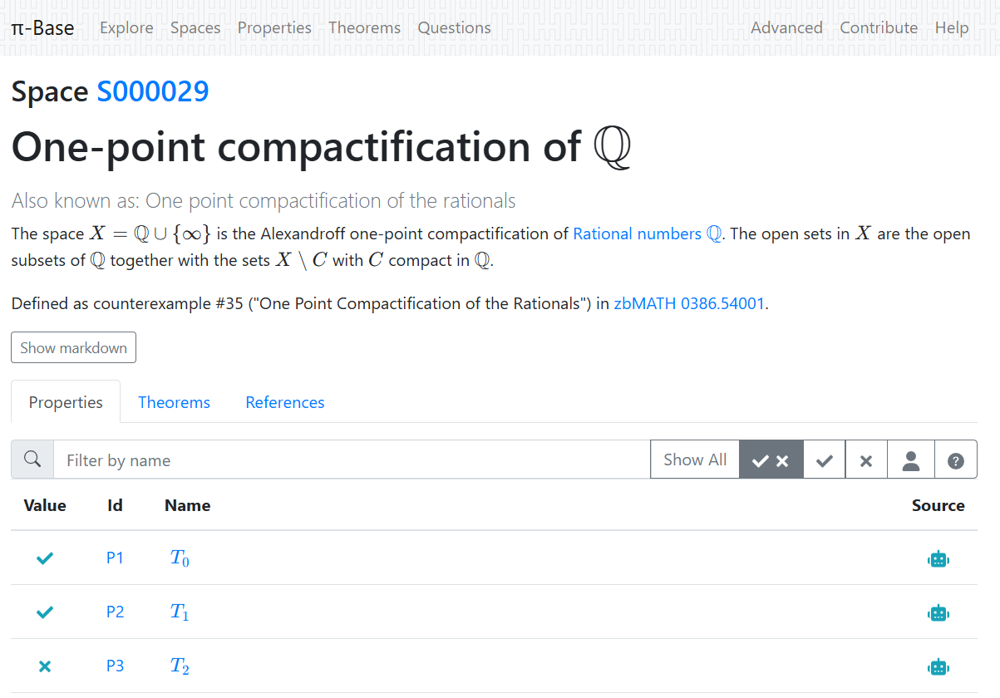

---

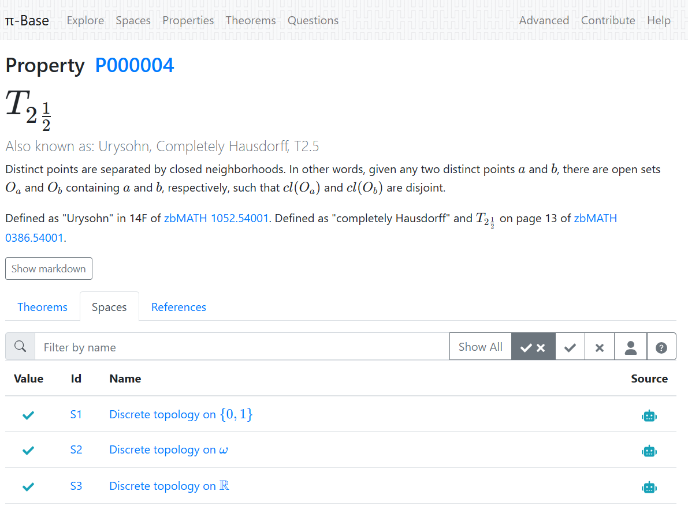

---

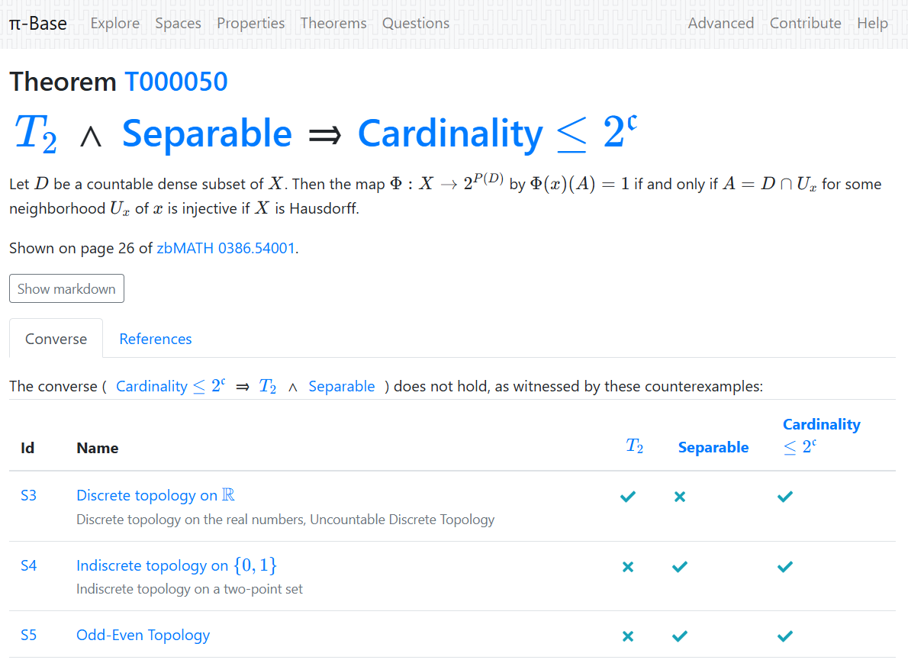

---

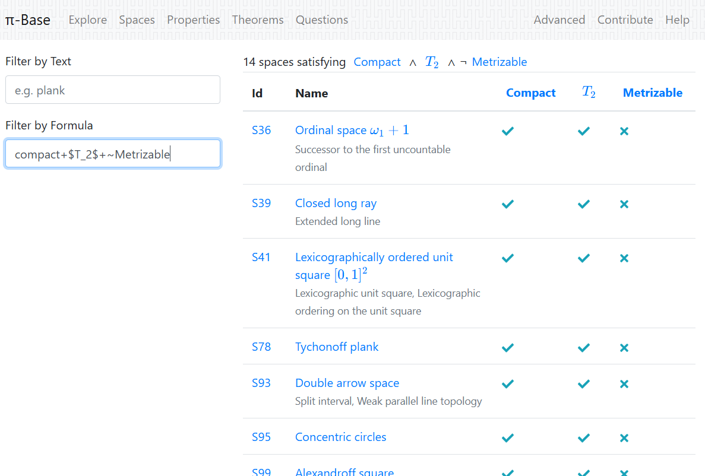

---

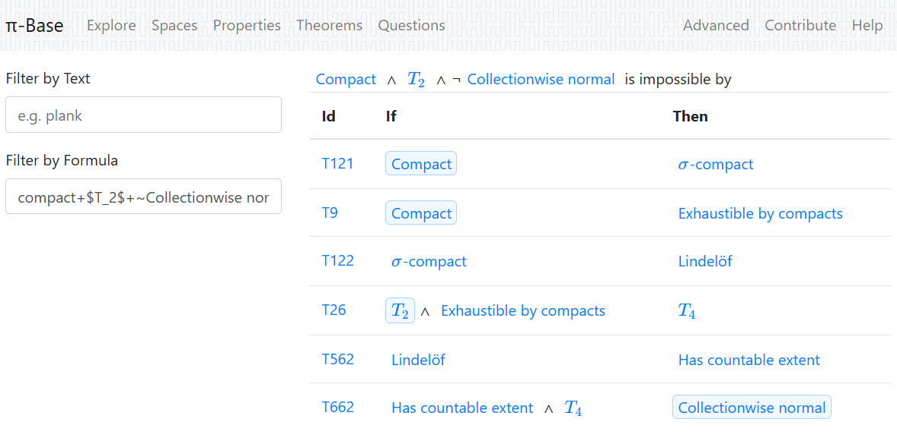

---

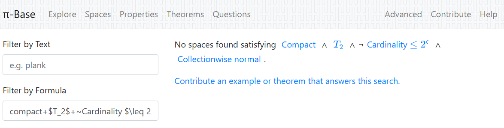

---

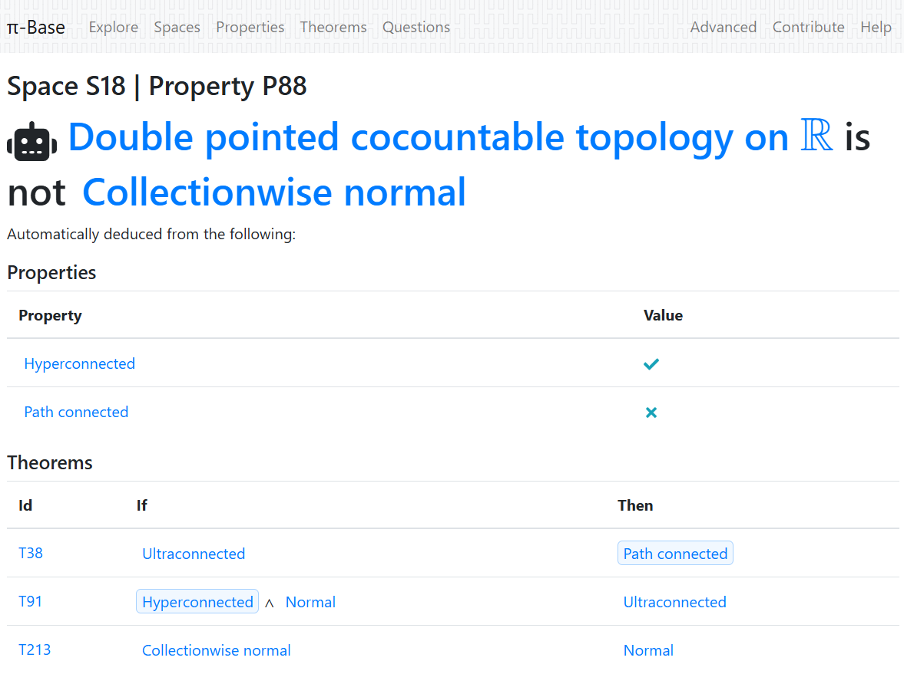

---

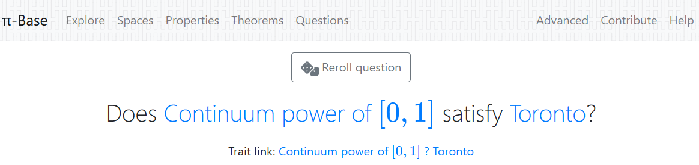

---

# Brief aside:

## Developing the $\pi$-Base as "scholarship"

* Even though I've put in a hopefully-successful application for full professor and can now do whatever I want (???), I think it's important to consider how academic labor "counts".
    * So how can folks make the $\pi$-Base "count"?
* I have two traditional papers inspired by $\pi$-Base work, a survey on $T_1$-not-$T_2$ properties [C., to appear], and a study on the generalization of "US" (Unique Sequential limits) to transfinite sequences [C. and Williams, 2025].

---

## Developing the $\pi$-Base as "scholarship", cont.

* LuCaNT is a conference series on mathematical databases, computation, and number theory.
    *  "But mostly number theory and the LMFDB"
* But I did contribute to LuCaNT's special issue of *Contemporary Mathematics* about the "$\pi$-Base model" itself: Objects (from any category), Properties, and Theorems.
* And in that paper, I pointed out another problem with making the $\pi$-Base "count", *in a different sense*...

---

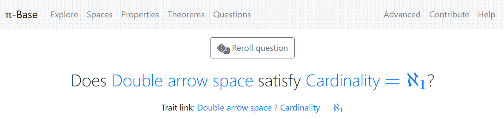

---

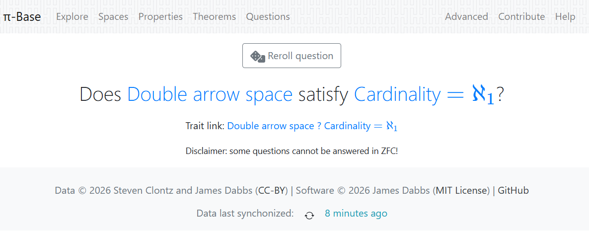

---

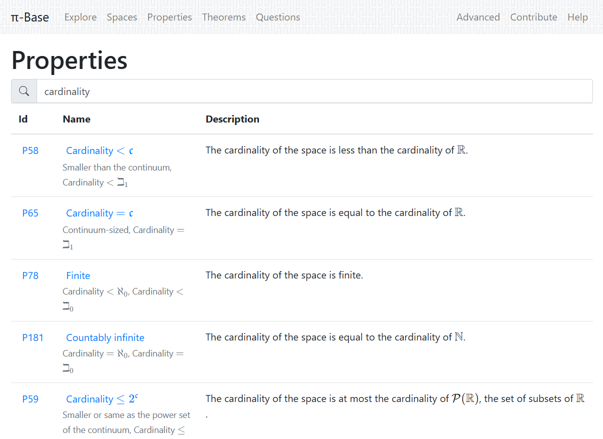

---

# Set Theory in the $\pi$-Base

So how can we expand the $\pi$-Base model to "know" about set theory (in so-much as it "knows" about topology at least)?

* Restrictions/considerations:
    * Implementation details: pretty sure there isn't an "ordinals/cardinals" Javascript library out there
    * Contributions: how will people contribute results involving set theory to the database?
    * Website: how will this data be presented to end-users?
    * Funding: the model shouldn't be applicable to / useful for just topology

---

# Modeling Cardinals

* Expressing cardinals:
    * Finite: `0`, `1`, `2`, ... for $\kappa < \aleph_0$
    * Infinite: `aleph 0`, `aleph 1`, ... for $\kappa = \aleph_n$
    * Also: `beth 1`, `beth 2`, ... for $\kappa = \beth_n=2^{\beth_{n-1}}$ (where $\beth_0=\aleph_0$)
* What about ordinals?
    * Problem: need to know things like `aleph n < beth m` ($\aleph_n<\beth_n$) for $n<m$.
    * Could support e.g. `aleph omega0+2` for $\aleph_{\omega+2}$. But need to write (find?) a library to know `7 < omega0+2`. (Is this necessary for MVP?)
* Cardinal characteristics of the continuum.
    * Maybe: `char_b`, `char_t`, `char_d`, ... for $\kappa = \mathfrak b, \mathfrak t, \mathfrak d, \dots$
    * Need to manually model e.g. $\mathfrak b\leq \mathfrak d\leq\beth_1$.

---

# Properties with cardinal values

We'll need to distinguish (existing) properties with **boolean** values:

```yaml
uid: P000089
name: Fixed point property
# values: boolean  # new key to keep existing functionality
```

---

... and hydrate others:

```yaml
uid: P000026
name: Separable
# values: boolean
```

```yaml
uid: P000209
name: Density $\leq\mathfrak c$
# values: boolean
```

as new properties with **cardinal** values:

```yaml
uid: P000xyz
name: Density
values: cardinal
```

---

# Cardinal-valued traits (space/property pairs)

Now we can replace such assertions:

```yaml
space: S000222  # Product topology on $\omega^{2^\mathfrak{c}}$
property: P000026  # Separable
value: true  # actually this is deduced automatically today
```

```yaml
space: S000222  # Product topology on $\omega^{2^\mathfrak{c}}$
property: P000209  # Density $\leq\mathfrak c$
value: true
```

with more expressive ones:

```yaml
space: S000222  # Product topology on $\omega^{2^\mathfrak{c}}$
property: P000xyz  # Density
value: beth 1  # Question: should we support "leq beth 1"?
```

---

# Now, theorems!

Consider the following theorem.

```yaml
uid: T000440
if:
  P000180: true  # Hereditarily separable
then:
  P000026: true  # Separable
```

The trivial generalization is "if every subspace has a dense subset of cardinality $\kappa$, then the space itself has a dense subset of cardinality $\kappa$".

---

Supporting a  seems most reasonable to me today:

```yaml
uid: T000xxx
if:
  P000yyy: kappa  # Hereditary density
then:
  P000xyz: kappa  # Density
```

Supporting notation like `kappa+` ($\kappa^+$) seems reasonable, but we lack the machinery for understanding e.g. $\mathfrak c^+$.

---

We also have this:

```yaml
uid: T000404
if:
  and:
    - P000079: true  # Sequential
    - P000099: true  # US
    - P000209: true  # Density $\leq\mathfrak c$
then:
  P000163: true  # Cardinality $\leq\mathfrak c$
```

---

Here I think we need to support `leq`:

```yaml
uid: T000404
if:
  and:
    - P000079: true  # Sequential
    - P000099: true  # US
    - P000xyz: leq beth 1  # Density
then:
  P000zyx: leq beth 1  # Cardinality
```

Of course, $\mathbb R$ is a sequential US space which has density $\beth_0$ but cardinality $\beth_1$.

---

# Implementation as software

So this means we just need a to program a few small things:

* A `Cardinality` class that understands $n$, $\aleph_n$, $\beth_n$, and "custom cardinals" e.g. $\mathfrak b$.
   * Also, `Cardinality.leq:boolean` so `new Cardinality("aleph 3") <= new Cardinality("beth 4")` returns `true` and `new Cardinality("char_b") < new Cardinality("aleph 1")` returns... `false`? `"undecidable"`?
* A string parser that reads `leq beth 3` and abstracts it to a `Cardinality` that represents $\leq \beth_3$.
* A deduction engine that understands the `kappa` placeholder in our theorems.
* That... that's all?!

---

# Ultimately...

With this infrastructure, we could not only have more expressive options to describe results in general and set-theoretic topology, but perhaps even support results beyond those which can be proven in ZFC?

As an easy example: $\mathbb R$ does not currently appear in a search for `Cardinality $\leq \aleph_1$ + Separable`. But it could if we had an `[x] Assume CH` option that tells `Cardinality` to assume that `new Cardinality("aleph 1") == new Cardinality("beth 1")`.

---

# Questions? Answers? Volunteers?

## References

- C.; Williams, Marshall. "Separation Axioms Among US." [Zbl 08109626](https://zbmath.org/8109626). Topology Appl. 375, Article ID 109467, 11 p. (2025).
- C. "Database-Driven Mathematical Inquiry and the $\pi$-Base Model for Small Semantic Databases." LuCaNT: Databases, Algorithms, and Computational Number Theory. Contemporary Mathematics. American Mathematical Society. (2026?).
- C. "Non-Hausdorff $T_1$ Properties." Colloquium Mathematicum. (2026?).